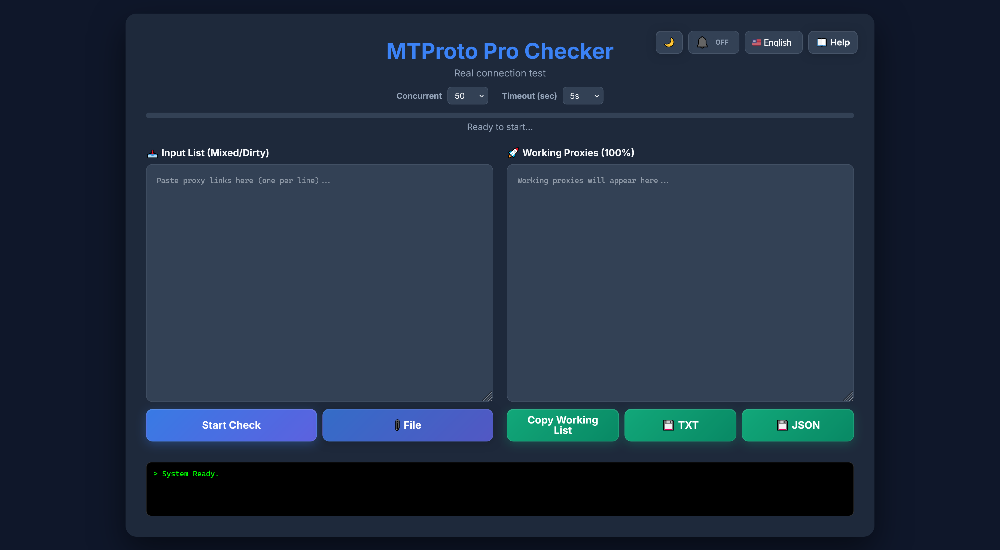

# 🛡️ MTProto Deep Checker

A powerful tool to verify **Telegram MTProto Proxies** by performing real protocol handshakes. Unlike simple TCP checkers, this tool attempts to fetch the actual server configuration from Telegram via the proxy, ensuring 100% connectivity and eliminating the "Connecting..." issue.



## 🌟 Features

* **Deep Inspection:** Uses `help.getNearestDC` / `help.GetConfig` requests to verify if the proxy can actually transfer Telegram data.
* **Go Backend:** Powered by `gotd/td` — fast, stable, single binary.
* **Smart Filtering:** Automatically detects and removes invalid secrets, spam links, and bad ports.
* **Modern UI:** Beautiful Dark Mode interface with real-time logs and progress bars.
* **File Upload:** Import proxy lists from .txt, .csv, or .list files.
* **Export Results:** Download working proxies as TXT or JSON files.
* **Bilingual:** Supports English, Persian (Farsi), Russian, and Chinese interfaces.
* **No Auth Needed:** Uses public test keys, so you don't need to log in with your phone number.

## 🚀 Installation

### Option 1 — Download .exe (Windows, no Node.js needed)

Grab `MTProto-Checker.exe` from [Releases](../../releases). Double-click to run.

> Browser opens automatically at `http://localhost:3000`.

### Option 2 — Run from source with Go (recommended)

#### Prerequisites
You need **Go 1.18+** installed. [Download it here](https://go.dev/dl/).

#### Steps
```bash
git clone https://github.com/rahgozar94725/MTProto-Checker.git
cd MTProto-Checker
go build -o mtproto-checker.exe .
.\mtproto-checker.exe
```

> Binary: ~21MB, no Node.js required.

## 📖 How to Use

1.  **Get Proxies:** Copy your list of mixed/dirty MTProto proxies.
    > **Tip:** You can find a huge list of free proxies in [this repository](https://github.com/SoliSpirit/mtproto).
2.  **Paste Links:** Paste them into the **"Input List"** box (formats like `tg://` or `https://t.me/proxy` are supported).
3.  **Start Check:** Click the **"Start Deep Check"** button.
4.  **Wait:** The tool will filter invalid formats first, then test connections in batches.
5.  **Copy Results:** Valid proxies will appear in the right panel. Click **"Copy"** to save them to your clipboard.

## ⚙️ How it Works

Many proxies respond to TCP pings but fail to encrypt/decrypt Telegram packets (Fake Proxies).
This tool does the following:
1.  **Parses & Sanitizes:** Cleans up broken links (e.g., `.&port` typos).
2.  **Validates Secret:** Rejects secrets that are too long (spam padding) or invalid.
3.  **Connects:** Establishes a secure MTProto connection through the proxy.
4.  **Invokes API:** Sends a `help.getNearestDC` request to Telegram Data Centers.
5.  **Result:** If the server replies, the proxy is marked as **Working** with its latency.

## 🛠 Dependencies

### Go Backend (recommended)
* [gotd/td](https://github.com/gotd/td) - MTProto API client with native MTProxy support
* No external dependencies needed — single binary


## ☕ Support

If you found this tool useful, you can support the development:

<a href="https://nowpayments.io/donation?api_key=d824db3b-fcf7-4ebb-8e3d-297c23cfeee2" target="_blank" rel="noreferrer noopener">
    
</a>

## 📝 License

This project is open-source and available under the [MIT License](LICENSE).

---
[Read in English](README.md) | [На русском](README_RU.md) | [中文](README_ZH.md) | [فارسی](README_FA.md)