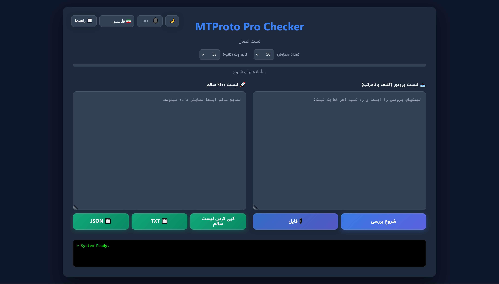

# 🛡️ تست دقیق پروکسی MTProto

یک ابزار قدرتمند و سبک برای تست واقعی پروکسی‌های تلگرام. برخلاف اکثر چکرها که فقط «پینگ» می‌گیرند، این ابزار واقعاً تلاش می‌کند اطلاعات را از سرور تلگرام دانلود کند. اگر پروکسی در این برنامه «سالم» نشان داده شود، یعنی **۱۰۰٪ در تلگرام وصل می‌شود** و روی حالت `Connecting` گیر نمی‌کند.

## ✨ ویژگی‌ها

* **تست واقعی (Deep Check):** ارسال درخواست `GetConfig` برای اطمینان از تبادل دیتا.
* **بدون نیاز به کامپایلر:** نوشته شده با **Go** — کامپایل سریع، باینری مستقل.
* **فیلتر هوشمند:** حذف خودکار لینک‌های خراب، سکرت‌های فیک (Spam/Padding) و پورت‌های نامعتبر.
* **رابط کاربری مدرن:** پنل تحت وب با تم تیره (Dark Mode)، لاگ لحظه‌ای و طراحی زیبا.
* **دو زبانه:** پشتیبانی کامل از زبان فارسی و انگلیسی.
* **پشتیبانی از فرمت‌های مختلف:** پشتیبانی از لینک‌های `tg://` و `https://t.me` حتی اگر فرمت بهم‌ریخته‌ای داشته باشند.

## 📦 نصب و راه‌اندازی

### گزینه ۱ — دانلود فایل .exe (ویندوز، بدون نیاز به Node.js)

فایل `MTProto-Checker.exe` را از [بخش Release](../../releases) دانلود کنید. دوبار کلیک کنید تا اجرا شود.

> مرورگر به صورت خودکار در آدرس `http://localhost:3000` باز می‌شود.

## 📖 راهنمای استفاده

1.  **دریافت پروکسی:** لیست پروکسی‌های خود را آماده کنید.
    > **نکته:** برای دریافت لیست بزرگی از پروکسی‌های رایگان می‌توانید از [این ریپازیتوری](https://github.com/SoliSpirit/mtproto) استفاده کنید.
2.  **وارد کردن:** لیست را در کادر **"لیست ورودی"** کپی کنید (برنامه خودش لینک‌ها را از بین متن‌های اضافی پیدا می‌کند).
3.  **شروع:** روی دکمه **"شروع بررسی دقیق"** کلیک کنید.
4.  **مشاهده:** در پایین صفحه، کنسول مشکی رنگ وضعیت لحظه‌ای را نشان می‌دهد.
5.  **کپی:** پروکسی‌های سالم در ستون سمت چپ (یا پایین در موبایل) لیست می‌شوند. با زدن دکمه **"کپی لیست سالم"**، آن‌ها را بردارید.

## ❓ چرا این ابزار بهتر است؟

بسیاری از ابزارهای موجود فقط اتصال TCP (باز بودن پورت) را چک می‌کنند. خیلی از سرورها پورتشان باز است اما فیلتر شده‌اند یا کانفیگ غلط دارند.
این ابزار یک «کلاینت واقعی تلگرام» در پس‌زمینه می‌سازد و دقیقاً مثل اپلیکیشن گوشی، سعی می‌کند به دیتاسنتر وصل شود. اگر موفق شود، یعنی پروکسی قطعا کار می‌کند.

## 🛠 تکنولوژی‌های استفاده شده

* **Go (gotd/td):** بک‌اند اصلی با پشتیبانی از MTProxy.
* **HTML/CSS Vanilla:** رابط کاربری سبک و بدون فریم‌ورک سنگین.

## ☕ حمایت (Donation)

اگر این ابزار برایتان مفید بود، می‌توانید از طریق لینک زیر حمایت کنید:

## 📄 لایسنس

این پروژه متن‌باز (Open Source) است و تحت لایسنس MIT منتشر شده است.