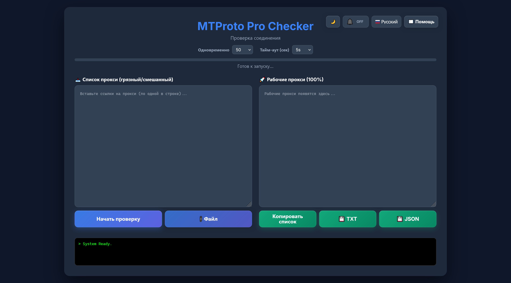

# 🛡️ MTProto Deep Checker

[Read in English](README.md) | [На русском](README_RU.md) | [中文](README_ZH.md) | [فارسی](README_FA.md)

Инструмент для проверки **Telegram MTProto прокси** с выполнением реального рукопожатия протокола. В отличие от простых TCP-чекеров, этот инструмент пытается получить конфигурацию сервера через прокси, гарантируя 100% работоспособность.



## 🌟 Возможности

* **Глубокая проверка:** Использует запросы `help.getNearestDC` / `help.GetConfig` для проверки передачи данных Telegram.
* **Go Backend:** Работает на `gotd/td` — быстро, стабильно, один бинарник.
* **Умная фильтрация:** Автоматически удаляет неверные секреты, спам-ссылки и плохие порты.
* **Современный UI:** Тёмная тема, логи в реальном времени, индикатор прогресса.
* **Загрузка файлов:** Импорт списка прокси из .txt, .csv или .list файлов.
* **Экспорт результатов:** Скачивание рабочих прокси в TXT или JSON.
* **Многоязычность:** Поддержка русского, английского, персидского и китайского языков.
* **Без авторизации:** Использует публичные тестовые ключи — не нужно входить по номеру телефона.
* **Пауза/Продолжение:** Поставьте проверку на паузу и продолжите с того же места без повторной проверки.

## 🚀 Установка

### Вариант 1 — Скачать из Releases

Скачайте готовый бинарник для вашей платформы из [Releases](../../releases).

| Платформа | Файл |
|-----------|------|
| Windows (amd64) | `mtproto-checker-windows-amd64.exe` |
| Linux (amd64) | `mtproto-checker-linux-amd64` |
| Linux (arm64) | `mtproto-checker-linux-arm64` |
| macOS (Intel) | `mtproto-checker-darwin-amd64` |
| macOS (Apple Silicon) | `mtproto-checker-darwin-arm64` |

Запустите бинарник. Браузер откроется автоматически по адресу `http://localhost:3000`.

### Вариант 2 — Сборка из исходников

Требуется **Go 1.18+**. [Скачать Go](https://go.dev/dl/).

```bash
git clone https://github.com/rahgozar94725/MTProto-Checker.git
cd MTProto-Checker
go build -o mtproto-checker .
./mtproto-checker
```

> Бинарник: ~21MB, других зависимостей нет.

## 📖 Как использовать

1.  **Получить прокси:** Скопируйте список смешанных MTProto прокси.
    > **Совет:** Большой список бесплатных прокси можно найти в [этом репозитории](https://github.com/SoliSpirit/mtproto).
2.  **Вставить ссылки:** Вставьте их в поле **"Список прокси"** (поддерживаются форматы `tg://` и `https://t.me/proxy`).
3.  **Запуск:** Нажмите **"Начать проверку"**.
4.  **Ожидание:** Инструмент сначала отфильтрует неверные форматы, затем проверит соединения.
5.  **Копирование:** Рабочие прокси появятся в правой панели. Нажмите **"Копировать"** чтобы сохранить.

## ⚙️ Как это работает

Многие прокси отвечают на TCP-пинг, но не могут шифровать/дешифровать пакеты Telegram (фейковые прокси).
Этот инструмент делает следующее:
1.  **Парсинг и очистка:** Исправляет битые ссылки (например, `.&port` опечатки).
2.  **Валидация секрета:** Отклоняет слишком длинные секреты (спам-паддинг) или неверные.
3.  **Подключение:** Устанавливает защищённое MTProto-соединение через прокси.
4.  **Вызов API:** Отправляет запрос `help.getNearestDC` в дата-центры Telegram.
5.  **Результат:** Если сервер отвечает, прокси помечается как **Рабочий** с указанием задержки.

## 🛠 Зависимости

### Go Backend (рекомендуется)
* [gotd/td](https://github.com/gotd/td) — MTProto API клиент с нативной поддержкой MTProxy
* Внешних зависимостей нет — один бинарник

## ☕ Поддержка

Если инструмент оказался полезным, вы можете поддержать разработку:

<a href="https://nowpayments.io/donation?api_key=d824db3b-fcf7-4ebb-8e3d-297c23cfeee2" target="_blank" rel="noreferrer noopener">
    
</a>

## 📝 Лицензия

Проект с открытым исходным кодом под лицензией [MIT](LICENSE).
